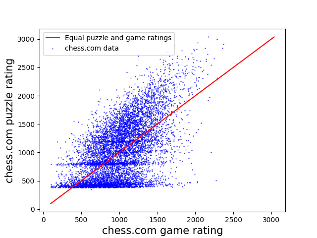

Exploring how chess.com puzzle rating correlates with chess rating

* Select all UK players
	* Seems one can only select players by country, not get a full list
	* Reject new accounts -  those which are less than 4 weeks old
* Get highest of bullet, rapid, blitz score
	* Require at least 10 games played of the selected category
* Get puzzle rating, requiring at least 1 puzzle completed
	* Cannot seem to have access to the number of puzzles played
	* 

